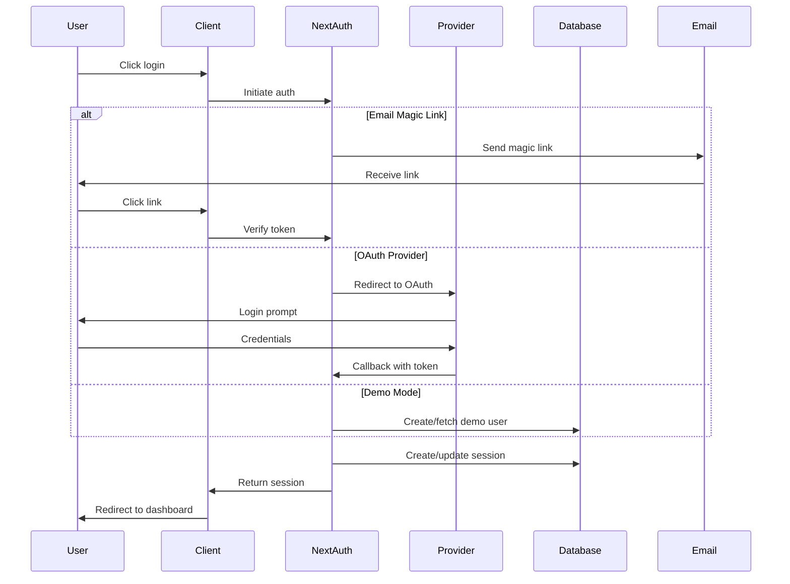
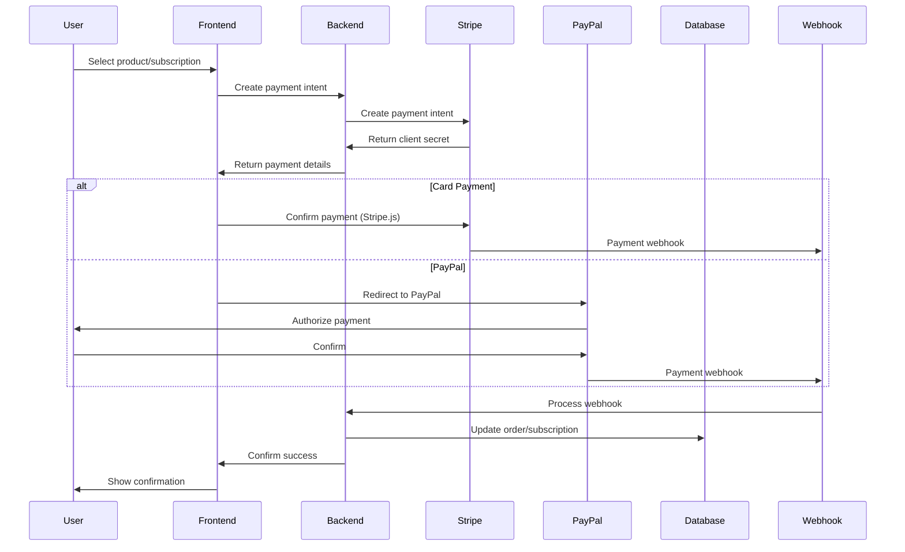

# Technical Architecture Document
## Authentication & Payment Systems Design

### Table of Contents
1. [Authentication Architecture](#authentication-architecture)
2. [Payment Architecture](#payment-architecture)
3. [Security Architecture](#security-architecture)
4. [Database Design](#database-design)
5. [API Design](#api-design)
6. [Infrastructure Architecture](#infrastructure-architecture)

---

## Authentication Architecture

### Overview
Multi-layered authentication system supporting various providers while maintaining security and user experience.

### Authentication Flow Diagram


### Provider Configuration

#### 1. Email Provider (Magic Links)
```typescript
// lib/auth/providers/email.ts
import { EmailProvider } from 'next-auth/providers/email';
import { sendVerificationEmail } from '@/lib/email';

export const emailProvider = EmailProvider({
  server: {
    host: process.env.SMTP_HOST,
    port: Number(process.env.SMTP_PORT),
    auth: {
      user: process.env.SMTP_USER,
      pass: process.env.SMTP_PASS,
    },
  },
  from: process.env.EMAIL_FROM,
  maxAge: 24 * 60 * 60, // 24 hours
  async sendVerificationRequest({ identifier, url, provider }) {
    // Custom email template with branding
    await sendVerificationEmail({
      to: identifier,
      url,
      theme: {
        brandColor: '#1e40af',
        buttonText: 'Sign in to 1001 Stories',
      },
    });
  },
});
```

#### 2. OAuth Providers
```typescript
// lib/auth/providers/oauth.ts
import GoogleProvider from 'next-auth/providers/google';
import GitHubProvider from 'next-auth/providers/github';
import AppleProvider from 'next-auth/providers/apple';

export const oauthProviders = [
  GoogleProvider({
    clientId: process.env.GOOGLE_CLIENT_ID!,
    clientSecret: process.env.GOOGLE_CLIENT_SECRET!,
    authorization: {
      params: {
        prompt: "consent",
        access_type: "offline",
        response_type: "code",
        scope: "openid email profile",
      },
    },
    profile(profile) {
      return {
        id: profile.sub,
        name: profile.name,
        email: profile.email,
        image: profile.picture,
        emailVerified: profile.email_verified ? new Date() : null,
      };
    },
  }),
  
  GitHubProvider({
    clientId: process.env.GITHUB_CLIENT_ID!,
    clientSecret: process.env.GITHUB_CLIENT_SECRET!,
    profile(profile) {
      return {
        id: profile.id.toString(),
        name: profile.name || profile.login,
        email: profile.email,
        image: profile.avatar_url,
      };
    },
  }),
  
  AppleProvider({
    clientId: process.env.APPLE_CLIENT_ID!,
    clientSecret: process.env.APPLE_CLIENT_SECRET!,
    profile(profile) {
      return {
        id: profile.sub,
        name: profile.name,
        email: profile.email,
        emailVerified: profile.email_verified ? new Date() : null,
      };
    },
  }),
];
```

### Session Management

#### JWT Strategy with Refresh Tokens
```typescript
// lib/auth/session.ts
import jwt from 'jsonwebtoken';
import { SessionUser } from '@/types/auth';

interface TokenPair {
  accessToken: string;
  refreshToken: string;
}

export class SessionManager {
  private static readonly ACCESS_TOKEN_EXPIRY = '15m';
  private static readonly REFRESH_TOKEN_EXPIRY = '7d';
  
  static generateTokenPair(user: SessionUser): TokenPair {
    const accessToken = jwt.sign(
      {
        id: user.id,
        email: user.email,
        role: user.role,
      },
      process.env.JWT_SECRET!,
      { expiresIn: this.ACCESS_TOKEN_EXPIRY }
    );
    
    const refreshToken = jwt.sign(
      { id: user.id },
      process.env.JWT_REFRESH_SECRET!,
      { expiresIn: this.REFRESH_TOKEN_EXPIRY }
    );
    
    return { accessToken, refreshToken };
  }
  
  static async refreshAccessToken(refreshToken: string): Promise<string> {
    try {
      const decoded = jwt.verify(refreshToken, process.env.JWT_REFRESH_SECRET!) as { id: string };
      const user = await prisma.user.findUnique({ where: { id: decoded.id } });
      
      if (!user) throw new Error('User not found');
      
      const { accessToken } = this.generateTokenPair({
        id: user.id,
        email: user.email,
        role: user.role,
      });
      
      return accessToken;
    } catch (error) {
      throw new Error('Invalid refresh token');
    }
  }
}
```

### Multi-Factor Authentication (MFA)

#### TOTP Implementation
```typescript
// lib/auth/mfa.ts
import speakeasy from 'speakeasy';
import QRCode from 'qrcode';

export class MFAService {
  static generateSecret(user: { email: string }) {
    return speakeasy.generateSecret({
      name: `1001 Stories (${user.email})`,
      issuer: '1001 Stories',
      length: 32,
    });
  }
  
  static async generateQRCode(secret: speakeasy.GeneratedSecret) {
    return QRCode.toDataURL(secret.otpauth_url!);
  }
  
  static verifyToken(token: string, secret: string): boolean {
    return speakeasy.totp.verify({
      secret,
      encoding: 'base32',
      token,
      window: 2, // Allow 2 time steps for clock skew
    });
  }
  
  static generateBackupCodes(count: number = 10): string[] {
    return Array.from({ length: count }, () => 
      speakeasy.generateSecret({ length: 8 }).base32
    );
  }
}
```

### Role-Based Access Control (RBAC)

#### Permission System
```typescript
// lib/auth/rbac.ts
export interface Permission {
  resource: string;
  action: string;
  conditions?: Record<string, any>;
}

export interface Role {
  name: UserRole;
  permissions: Permission[];
  inherits?: UserRole[];
}

export const ROLE_DEFINITIONS: Role[] = [
  {
    name: 'LEARNER',
    permissions: [
      { resource: 'story', action: 'read' },
      { resource: 'profile', action: 'update', conditions: { own: true } },
      { resource: 'course', action: 'enroll' },
      { resource: 'progress', action: 'track' },
    ],
  },
  {
    name: 'TEACHER',
    inherits: ['LEARNER'],
    permissions: [
      { resource: 'class', action: 'create' },
      { resource: 'class', action: 'manage', conditions: { own: true } },
      { resource: 'assignment', action: 'create' },
      { resource: 'student', action: 'view', conditions: { inClass: true } },
    ],
  },
  {
    name: 'INSTITUTION',
    inherits: ['TEACHER'],
    permissions: [
      { resource: 'teacher', action: 'manage' },
      { resource: 'program', action: 'create' },
      { resource: 'report', action: 'generate' },
      { resource: 'subscription', action: 'manage' },
    ],
  },
  {
    name: 'VOLUNTEER',
    permissions: [
      { resource: 'story', action: 'translate' },
      { resource: 'story', action: 'illustrate' },
      { resource: 'project', action: 'join' },
      { resource: 'hours', action: 'log' },
    ],
  },
  {
    name: 'ADMIN',
    permissions: [
      { resource: '*', action: '*' }, // Full access
    ],
  },
];

export class PermissionChecker {
  static canAccess(
    userRole: UserRole,
    resource: string,
    action: string,
    context?: Record<string, any>
  ): boolean {
    const role = this.getRoleWithInheritance(userRole);
    
    return role.permissions.some(permission => {
      const resourceMatch = permission.resource === '*' || permission.resource === resource;
      const actionMatch = permission.action === '*' || permission.action === action;
      
      if (!resourceMatch || !actionMatch) return false;
      
      if (permission.conditions && context) {
        return Object.entries(permission.conditions).every(
          ([key, value]) => context[key] === value
        );
      }
      
      return true;
    });
  }
  
  private static getRoleWithInheritance(roleName: UserRole): Role {
    const role = ROLE_DEFINITIONS.find(r => r.name === roleName);
    if (!role) throw new Error(`Role ${roleName} not found`);
    
    const permissions = [...role.permissions];
    
    if (role.inherits) {
      role.inherits.forEach(inheritedRole => {
        const inherited = this.getRoleWithInheritance(inheritedRole);
        permissions.push(...inherited.permissions);
      });
    }
    
    return { ...role, permissions };
  }
}
```

---

## Payment Architecture

### Payment Flow Overview


### Payment Provider Integration

#### Stripe Integration
```typescript
// lib/payments/stripe.ts
import Stripe from 'stripe';

export class StripeService {
  private stripe: Stripe;
  
  constructor() {
    this.stripe = new Stripe(process.env.STRIPE_SECRET_KEY!, {
      apiVersion: '2023-10-16',
    });
  }
  
  async createPaymentIntent(amount: number, currency: string, metadata?: Record<string, string>) {
    return this.stripe.paymentIntents.create({
      amount: Math.round(amount * 100), // Convert to cents
      currency,
      automatic_payment_methods: {
        enabled: true,
      },
      metadata: {
        ...metadata,
        platform: '1001-stories',
      },
    });
  }
  
  async createSubscription(customerId: string, priceId: string, trialDays?: number) {
    return this.stripe.subscriptions.create({
      customer: customerId,
      items: [{ price: priceId }],
      trial_period_days: trialDays,
      payment_behavior: 'default_incomplete',
      payment_settings: {
        save_default_payment_method: 'on_subscription',
      },
      expand: ['latest_invoice.payment_intent'],
    });
  }
  
  async createCustomerPortalSession(customerId: string) {
    return this.stripe.billingPortal.sessions.create({
      customer: customerId,
      return_url: `${process.env.NEXT_PUBLIC_URL}/dashboard`,
    });
  }
  
  async handleWebhook(payload: string, signature: string) {
    try {
      const event = this.stripe.webhooks.constructEvent(
        payload,
        signature,
        process.env.STRIPE_WEBHOOK_SECRET!
      );
      
      switch (event.type) {
        case 'payment_intent.succeeded':
          await this.handlePaymentSuccess(event.data.object);
          break;
        case 'subscription.created':
        case 'subscription.updated':
        case 'subscription.deleted':
          await this.handleSubscriptionUpdate(event.data.object);
          break;
        case 'invoice.payment_failed':
          await this.handlePaymentFailure(event.data.object);
          break;
      }
      
      return { received: true };
    } catch (error) {
      throw new Error(`Webhook error: ${error.message}`);
    }
  }
  
  private async handlePaymentSuccess(paymentIntent: Stripe.PaymentIntent) {
    // Update order status in database
    await prisma.order.update({
      where: { paymentIntentId: paymentIntent.id },
      data: { 
        status: 'PAID',
        paidAt: new Date(),
      },
    });
  }
  
  private async handleSubscriptionUpdate(subscription: Stripe.Subscription) {
    // Update subscription status in database
    await prisma.subscription.update({
      where: { stripeSubscriptionId: subscription.id },
      data: {
        status: subscription.status.toUpperCase(),
        currentPeriodEnd: new Date(subscription.current_period_end * 1000),
      },
    });
  }
  
  private async handlePaymentFailure(invoice: Stripe.Invoice) {
    // Handle failed payment
    await prisma.notification.create({
      data: {
        userId: invoice.metadata.userId,
        type: 'PAYMENT_FAILED',
        title: 'Payment Failed',
        message: 'Your payment could not be processed. Please update your payment method.',
      },
    });
  }
}
```

#### PayPal Integration
```typescript
// lib/payments/paypal.ts
import axios from 'axios';

export class PayPalService {
  private baseURL: string;
  private clientId: string;
  private clientSecret: string;
  
  constructor() {
    this.baseURL = process.env.PAYPAL_MODE === 'live' 
      ? 'https://api-m.paypal.com'
      : 'https://api-m.sandbox.paypal.com';
    this.clientId = process.env.PAYPAL_CLIENT_ID!;
    this.clientSecret = process.env.PAYPAL_CLIENT_SECRET!;
  }
  
  private async getAccessToken(): Promise<string> {
    const auth = Buffer.from(`${this.clientId}:${this.clientSecret}`).toString('base64');
    
    const response = await axios.post(
      `${this.baseURL}/v1/oauth2/token`,
      'grant_type=client_credentials',
      {
        headers: {
          Authorization: `Basic ${auth}`,
          'Content-Type': 'application/x-www-form-urlencoded',
        },
      }
    );
    
    return response.data.access_token;
  }
  
  async createOrder(amount: number, currency: string) {
    const accessToken = await this.getAccessToken();
    
    const response = await axios.post(
      `${this.baseURL}/v2/checkout/orders`,
      {
        intent: 'CAPTURE',
        purchase_units: [{
          amount: {
            currency_code: currency,
            value: amount.toFixed(2),
          },
          description: '1001 Stories Purchase',
        }],
        application_context: {
          return_url: `${process.env.NEXT_PUBLIC_URL}/api/payments/paypal/success`,
          cancel_url: `${process.env.NEXT_PUBLIC_URL}/api/payments/paypal/cancel`,
        },
      },
      {
        headers: {
          Authorization: `Bearer ${accessToken}`,
          'Content-Type': 'application/json',
        },
      }
    );
    
    return response.data;
  }
  
  async captureOrder(orderId: string) {
    const accessToken = await this.getAccessToken();
    
    const response = await axios.post(
      `${this.baseURL}/v2/checkout/orders/${orderId}/capture`,
      {},
      {
        headers: {
          Authorization: `Bearer ${accessToken}`,
          'Content-Type': 'application/json',
        },
      }
    );
    
    return response.data;
  }
}
```

### Subscription Management

#### Subscription State Machine
```typescript
// lib/payments/subscription-manager.ts
export enum SubscriptionStatus {
  TRIAL = 'TRIAL',
  ACTIVE = 'ACTIVE',
  PAST_DUE = 'PAST_DUE',
  PAUSED = 'PAUSED',
  CANCELED = 'CANCELED',
  EXPIRED = 'EXPIRED',
}

export class SubscriptionManager {
  private static transitions: Record<SubscriptionStatus, SubscriptionStatus[]> = {
    [SubscriptionStatus.TRIAL]: [SubscriptionStatus.ACTIVE, SubscriptionStatus.CANCELED],
    [SubscriptionStatus.ACTIVE]: [SubscriptionStatus.PAST_DUE, SubscriptionStatus.PAUSED, SubscriptionStatus.CANCELED],
    [SubscriptionStatus.PAST_DUE]: [SubscriptionStatus.ACTIVE, SubscriptionStatus.CANCELED],
    [SubscriptionStatus.PAUSED]: [SubscriptionStatus.ACTIVE, SubscriptionStatus.CANCELED],
    [SubscriptionStatus.CANCELED]: [SubscriptionStatus.EXPIRED],
    [SubscriptionStatus.EXPIRED]: [],
  };
  
  static canTransition(from: SubscriptionStatus, to: SubscriptionStatus): boolean {
    return this.transitions[from]?.includes(to) ?? false;
  }
  
  static async updateSubscriptionStatus(
    subscriptionId: string,
    newStatus: SubscriptionStatus
  ): Promise<void> {
    const subscription = await prisma.subscription.findUnique({
      where: { id: subscriptionId },
    });
    
    if (!subscription) {
      throw new Error('Subscription not found');
    }
    
    const currentStatus = subscription.status as SubscriptionStatus;
    
    if (!this.canTransition(currentStatus, newStatus)) {
      throw new Error(`Cannot transition from ${currentStatus} to ${newStatus}`);
    }
    
    await prisma.subscription.update({
      where: { id: subscriptionId },
      data: {
        status: newStatus,
        updatedAt: new Date(),
      },
    });
    
    // Trigger status change events
    await this.handleStatusChange(subscriptionId, currentStatus, newStatus);
  }
  
  private static async handleStatusChange(
    subscriptionId: string,
    oldStatus: SubscriptionStatus,
    newStatus: SubscriptionStatus
  ): Promise<void> {
    // Handle status-specific logic
    switch (newStatus) {
      case SubscriptionStatus.ACTIVE:
        await this.activateSubscriptionFeatures(subscriptionId);
        break;
      case SubscriptionStatus.PAST_DUE:
        await this.sendPaymentReminderEmail(subscriptionId);
        break;
      case SubscriptionStatus.CANCELED:
        await this.scheduleDataRetention(subscriptionId);
        break;
    }
    
    // Log status change
    await prisma.activityLog.create({
      data: {
        subscriptionId,
        action: 'STATUS_CHANGE',
        details: {
          from: oldStatus,
          to: newStatus,
        },
        timestamp: new Date(),
      },
    });
  }
  
  private static async activateSubscriptionFeatures(subscriptionId: string) {
    // Enable premium features for the user
    const subscription = await prisma.subscription.findUnique({
      where: { id: subscriptionId },
      include: { user: true },
    });
    
    if (subscription) {
      await prisma.user.update({
        where: { id: subscription.userId },
        data: {
          features: {
            unlimited_stories: true,
            advanced_analytics: true,
            priority_support: true,
          },
        },
      });
    }
  }
  
  private static async sendPaymentReminderEmail(subscriptionId: string) {
    // Send payment reminder email
    const subscription = await prisma.subscription.findUnique({
      where: { id: subscriptionId },
      include: { user: true },
    });
    
    if (subscription) {
      await emailService.sendTemplate('payment-reminder', {
        to: subscription.user.email,
        data: {
          name: subscription.user.name,
          dueAmount: subscription.price,
          updatePaymentUrl: `${process.env.NEXT_PUBLIC_URL}/billing`,
        },
      });
    }
  }
  
  private static async scheduleDataRetention(subscriptionId: string) {
    // Schedule data retention after grace period
    const gracePeriodDays = 30;
    const retentionDate = new Date();
    retentionDate.setDate(retentionDate.getDate() + gracePeriodDays);
    
    await prisma.scheduledTask.create({
      data: {
        type: 'DATA_RETENTION',
        targetId: subscriptionId,
        scheduledFor: retentionDate,
        status: 'PENDING',
      },
    });
  }
}
```

---

## Security Architecture

### Security Layers
```yaml
Application Security:
  - Input validation (Zod schemas)
  - XSS protection (DOMPurify)
  - CSRF tokens
  - Rate limiting
  - Request signing

Network Security:
  - HTTPS everywhere
  - WAF (Web Application Firewall)
  - DDoS protection (Cloudflare)
  - IP whitelisting for admin
  - VPN for internal services

Data Security:
  - Encryption at rest (AES-256)
  - Encryption in transit (TLS 1.3)
  - Field-level encryption for PII
  - Key rotation policy
  - Secure key management (AWS KMS)

Access Control:
  - Role-based permissions
  - Attribute-based access
  - Principle of least privilege
  - Session timeout
  - Device fingerprinting
```

### Security Middleware
```typescript
// middleware/security.ts
import { NextRequest, NextResponse } from 'next/server';
import { rateLimit } from '@/lib/rate-limit';
import { validateCSRF } from '@/lib/csrf';
import { sanitizeInput } from '@/lib/sanitize';

export async function securityMiddleware(req: NextRequest) {
  // Rate limiting
  const identifier = req.ip || 'anonymous';
  const rateLimitResult = await rateLimit.check(identifier);
  
  if (!rateLimitResult.success) {
    return NextResponse.json(
      { error: 'Too many requests' },
      { 
        status: 429,
        headers: {
          'Retry-After': rateLimitResult.retryAfter.toString(),
        },
      }
    );
  }
  
  // CSRF validation for state-changing operations
  if (['POST', 'PUT', 'DELETE', 'PATCH'].includes(req.method)) {
    const csrfToken = req.headers.get('x-csrf-token');
    
    if (!validateCSRF(csrfToken)) {
      return NextResponse.json(
        { error: 'Invalid CSRF token' },
        { status: 403 }
      );
    }
  }
  
  // Security headers
  const response = NextResponse.next();
  
  response.headers.set('X-Frame-Options', 'DENY');
  response.headers.set('X-Content-Type-Options', 'nosniff');
  response.headers.set('X-XSS-Protection', '1; mode=block');
  response.headers.set('Referrer-Policy', 'strict-origin-when-cross-origin');
  response.headers.set(
    'Content-Security-Policy',
    "default-src 'self'; script-src 'self' 'unsafe-inline' https://js.stripe.com; style-src 'self' 'unsafe-inline'; img-src 'self' data: https:; connect-src 'self' https://api.stripe.com"
  );
  response.headers.set(
    'Strict-Transport-Security',
    'max-age=31536000; includeSubDomains; preload'
  );
  
  return response;
}
```

### Audit Logging
```typescript
// lib/audit.ts
export interface AuditLog {
  id: string;
  userId: string;
  action: string;
  resource: string;
  resourceId?: string;
  details?: Record<string, any>;
  ip: string;
  userAgent: string;
  timestamp: Date;
  result: 'SUCCESS' | 'FAILURE';
}

export class AuditLogger {
  static async log(entry: Omit<AuditLog, 'id' | 'timestamp'>) {
    await prisma.auditLog.create({
      data: {
        ...entry,
        timestamp: new Date(),
      },
    });
    
    // Alert on suspicious activities
    if (this.isSuspicious(entry)) {
      await this.alertSecurityTeam(entry);
    }
  }
  
  private static isSuspicious(entry: Partial<AuditLog>): boolean {
    const suspiciousActions = [
      'MULTIPLE_FAILED_LOGINS',
      'PRIVILEGE_ESCALATION',
      'DATA_EXPORT',
      'ADMIN_ACCESS',
      'PAYMENT_MODIFICATION',
    ];
    
    return suspiciousActions.includes(entry.action || '');
  }
  
  private static async alertSecurityTeam(entry: Partial<AuditLog>) {
    await emailService.sendAlert({
      to: process.env.SECURITY_TEAM_EMAIL!,
      subject: `Security Alert: ${entry.action}`,
      data: entry,
    });
  }
}
```

---

## Database Design

### Enhanced Schema for Payments
```prisma
// prisma/schema.prisma additions

model PaymentMethod {
  id            String   @id @default(cuid())
  userId        String
  type          String   // 'card', 'paypal', 'bank'
  provider      String   // 'stripe', 'paypal'
  last4         String?  // Last 4 digits of card
  brand         String?  // Card brand
  expiryMonth   Int?
  expiryYear    Int?
  isDefault     Boolean  @default(false)
  metadata      Json?
  createdAt     DateTime @default(now())
  updatedAt     DateTime @updatedAt
  
  user          User     @relation(fields: [userId], references: [id])
  
  @@index([userId])
  @@map("payment_methods")
}

model SubscriptionPlan {
  id            String   @id @default(cuid())
  name          String
  description   String?
  price         Decimal  @db.Decimal(10, 2)
  currency      String   @default("USD")
  interval      String   // 'monthly', 'yearly'
  trialDays     Int      @default(0)
  features      Json     // Array of feature strings
  limits        Json     // { stories: 15, downloads: 5 }
  stripePriceId String?  @unique
  isActive      Boolean  @default(true)
  createdAt     DateTime @default(now())
  updatedAt     DateTime @updatedAt
  
  subscriptions Subscription[]
  
  @@map("subscription_plans")
}

model Subscription {
  id                   String           @id @default(cuid())
  userId               String           @unique
  planId               String
  status               String           // 'TRIAL', 'ACTIVE', 'PAST_DUE', etc.
  stripeSubscriptionId String?          @unique
  paypalSubscriptionId String?          @unique
  currentPeriodStart   DateTime
  currentPeriodEnd     DateTime
  cancelAtPeriodEnd    Boolean          @default(false)
  canceledAt           DateTime?
  trialEnd             DateTime?
  metadata             Json?
  createdAt            DateTime         @default(now())
  updatedAt            DateTime         @updatedAt
  
  user                 User             @relation(fields: [userId], references: [id])
  plan                 SubscriptionPlan @relation(fields: [planId], references: [id])
  invoices             Invoice[]
  
  @@index([userId])
  @@index([status])
  @@map("subscriptions")
}

model Invoice {
  id                String   @id @default(cuid())
  subscriptionId    String
  stripeInvoiceId   String?  @unique
  amount            Decimal  @db.Decimal(10, 2)
  currency          String
  status            String   // 'DRAFT', 'OPEN', 'PAID', 'VOID'
  dueDate           DateTime?
  paidAt            DateTime?
  invoiceNumber     String   @unique
  lineItems         Json
  metadata          Json?
  createdAt         DateTime @default(now())
  updatedAt         DateTime @updatedAt
  
  subscription      Subscription @relation(fields: [subscriptionId], references: [id])
  
  @@index([subscriptionId])
  @@index([status])
  @@map("invoices")
}

model AuditLog {
  id            String   @id @default(cuid())
  userId        String?
  action        String
  resource      String
  resourceId    String?
  details       Json?
  ip            String
  userAgent     String
  result        String   // 'SUCCESS', 'FAILURE'
  timestamp     DateTime @default(now())
  
  user          User?    @relation(fields: [userId], references: [id])
  
  @@index([userId])
  @@index([action])
  @@index([timestamp])
  @@map("audit_logs")
}
```

---

## API Design

### RESTful API Structure
```typescript
// API Routes Structure
/api/v1/
  /auth/
    POST   /login         - Email/OAuth login
    POST   /logout        - End session
    POST   /refresh       - Refresh access token
    GET    /session       - Get current session
    POST   /mfa/setup     - Setup 2FA
    POST   /mfa/verify    - Verify 2FA code
    
  /users/
    GET    /me           - Get current user
    PATCH  /me           - Update profile
    DELETE /me           - Delete account
    GET    /me/sessions  - List active sessions
    
  /payments/
    POST   /intents      - Create payment intent
    POST   /confirm      - Confirm payment
    GET    /methods      - List payment methods
    POST   /methods      - Add payment method
    DELETE /methods/:id  - Remove payment method
    
  /subscriptions/
    GET    /plans        - List available plans
    POST   /subscribe    - Create subscription
    PATCH  /:id          - Update subscription
    DELETE /:id          - Cancel subscription
    GET    /portal       - Get billing portal URL
    
  /webhooks/
    POST   /stripe       - Stripe webhooks
    POST   /paypal       - PayPal webhooks
```

### GraphQL Schema (Future)
```graphql
# GraphQL schema for v1.1.0
type User {
  id: ID!
  email: String!
  name: String
  role: UserRole!
  subscription: Subscription
  profile: Profile
  stats: UserStats
}

type Subscription {
  id: ID!
  plan: SubscriptionPlan!
  status: SubscriptionStatus!
  currentPeriodEnd: DateTime!
  cancelAtPeriodEnd: Boolean!
}

type Query {
  me: User
  subscription: Subscription
  subscriptionPlans: [SubscriptionPlan!]!
  paymentMethods: [PaymentMethod!]!
}

type Mutation {
  updateProfile(input: UpdateProfileInput!): User!
  createSubscription(planId: ID!): Subscription!
  cancelSubscription: Subscription!
  addPaymentMethod(input: PaymentMethodInput!): PaymentMethod!
}
```

---

## Infrastructure Architecture

### AWS Architecture
```yaml
Production Infrastructure:
  Compute:
    - ECS Fargate for containerized apps
    - Lambda for serverless functions
    - EC2 for persistent services
    
  Storage:
    - S3 for static assets and backups
    - EFS for shared file storage
    - CloudFront CDN for global distribution
    
  Database:
    - RDS PostgreSQL (Multi-AZ)
    - ElastiCache Redis for caching
    - DynamoDB for session storage
    
  Security:
    - WAF for application firewall
    - Secrets Manager for credentials
    - KMS for encryption keys
    - CloudTrail for audit logs
    
  Monitoring:
    - CloudWatch for metrics
    - X-Ray for distributed tracing
    - SNS for alerts
    
  Networking:
    - VPC with public/private subnets
    - ALB for load balancing
    - Route 53 for DNS
```

### Docker Configuration
```dockerfile
# Dockerfile.production
FROM node:20-alpine AS deps
WORKDIR /app
COPY package*.json ./
RUN npm ci --only=production

FROM node:20-alpine AS builder
WORKDIR /app
COPY package*.json ./
RUN npm ci
COPY . .
RUN npm run build

FROM node:20-alpine AS runner
WORKDIR /app

ENV NODE_ENV production
ENV NEXT_TELEMETRY_DISABLED 1

RUN addgroup --system --gid 1001 nodejs
RUN adduser --system --uid 1001 nextjs

COPY --from=builder /app/public ./public
COPY --from=builder /app/.next/standalone ./
COPY --from=builder /app/.next/static ./.next/static

USER nextjs

EXPOSE 3000

ENV PORT 3000

CMD ["node", "server.js"]
```

### Kubernetes Deployment (Future)
```yaml
# k8s/deployment.yaml
apiVersion: apps/v1
kind: Deployment
metadata:
  name: 1001-stories-app
spec:
  replicas: 3
  selector:
    matchLabels:
      app: 1001-stories
  template:
    metadata:
      labels:
        app: 1001-stories
    spec:
      containers:
      - name: app
        image: 1001-stories:latest
        ports:
        - containerPort: 3000
        env:
        - name: DATABASE_URL
          valueFrom:
            secretKeyRef:
              name: database-secret
              key: url
        resources:
          requests:
            memory: "256Mi"
            cpu: "250m"
          limits:
            memory: "512Mi"
            cpu: "500m"
        livenessProbe:
          httpGet:
            path: /api/health
            port: 3000
          initialDelaySeconds: 30
          periodSeconds: 10
        readinessProbe:
          httpGet:
            path: /api/ready
            port: 3000
          initialDelaySeconds: 5
          periodSeconds: 5
```

---

## Performance Optimization

### Caching Strategy
```typescript
// lib/cache.ts
import Redis from 'ioredis';

export class CacheManager {
  private redis: Redis;
  
  constructor() {
    this.redis = new Redis({
      host: process.env.REDIS_HOST,
      port: Number(process.env.REDIS_PORT),
      password: process.env.REDIS_PASSWORD,
    });
  }
  
  // Cache layers
  async get<T>(key: string, fallback: () => Promise<T>, ttl: number = 3600): Promise<T> {
    // L1: Memory cache (in-process)
    const memoryCache = this.getFromMemory(key);
    if (memoryCache) return memoryCache;
    
    // L2: Redis cache
    const redisCache = await this.redis.get(key);
    if (redisCache) {
      const data = JSON.parse(redisCache);
      this.setInMemory(key, data);
      return data;
    }
    
    // L3: Database/API call
    const data = await fallback();
    
    // Update all cache layers
    await this.redis.setex(key, ttl, JSON.stringify(data));
    this.setInMemory(key, data);
    
    return data;
  }
  
  async invalidate(pattern: string) {
    const keys = await this.redis.keys(pattern);
    if (keys.length > 0) {
      await this.redis.del(...keys);
    }
    this.clearMemoryCache(pattern);
  }
  
  private memoryCache = new Map<string, { data: any; expires: number }>();
  
  private getFromMemory(key: string) {
    const cached = this.memoryCache.get(key);
    if (cached && cached.expires > Date.now()) {
      return cached.data;
    }
    return null;
  }
  
  private setInMemory(key: string, data: any, ttl: number = 300) {
    this.memoryCache.set(key, {
      data,
      expires: Date.now() + ttl * 1000,
    });
  }
  
  private clearMemoryCache(pattern: string) {
    const regex = new RegExp(pattern.replace('*', '.*'));
    for (const key of this.memoryCache.keys()) {
      if (regex.test(key)) {
        this.memoryCache.delete(key);
      }
    }
  }
}
```

---

## Monitoring & Observability

### Application Performance Monitoring
```typescript
// lib/monitoring.ts
import * as Sentry from '@sentry/nextjs';
import { StatsD } from 'node-statsd';

export class MonitoringService {
  private statsd: StatsD;
  
  constructor() {
    this.statsd = new StatsD({
      host: process.env.STATSD_HOST,
      port: 8125,
      prefix: '1001stories.',
    });
    
    Sentry.init({
      dsn: process.env.SENTRY_DSN,
      environment: process.env.NODE_ENV,
      tracesSampleRate: 0.1,
      profilesSampleRate: 0.1,
    });
  }
  
  // Performance metrics
  async trackApiCall(endpoint: string, duration: number, status: number) {
    this.statsd.timing(`api.${endpoint}.duration`, duration);
    this.statsd.increment(`api.${endpoint}.status.${status}`);
  }
  
  // Business metrics
  async trackConversion(event: string, value?: number) {
    this.statsd.increment(`conversion.${event}`);
    if (value) {
      this.statsd.gauge(`conversion.${event}.value`, value);
    }
  }
  
  // Error tracking
  async trackError(error: Error, context?: Record<string, any>) {
    Sentry.captureException(error, {
      extra: context,
    });
    
    this.statsd.increment('errors.total');
  }
  
  // Custom metrics
  async trackCustomMetric(name: string, value: number, type: 'counter' | 'gauge' | 'timer') {
    switch (type) {
      case 'counter':
        this.statsd.increment(name, value);
        break;
      case 'gauge':
        this.statsd.gauge(name, value);
        break;
      case 'timer':
        this.statsd.timing(name, value);
        break;
    }
  }
}
```

---

*This technical architecture document provides the foundation for building a secure, scalable, and maintainable platform for 1001 Stories.*

**Document Version:** 1.0.0
**Last Updated:** 2025-01-15
**Next Review:** 2025-02-01