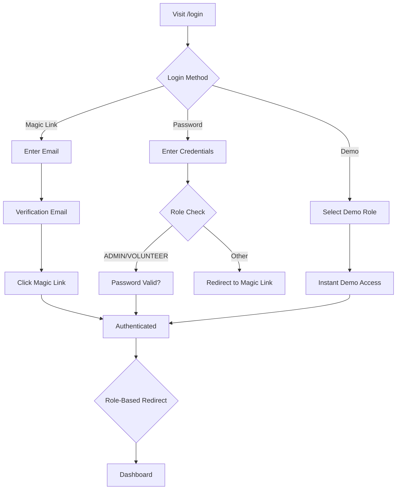

# 1001 Stories Authentication & Role System Documentation

**Version**: Current Implementation (Pre-Redesign)  
**Date**: August 28, 2025  
**Purpose**: Baseline documentation for role system redesign project

---

## Table of Contents

1. [Executive Summary](#executive-summary)
2. [Current Authentication Architecture](#current-authentication-architecture)
3. [Current Role System](#current-role-system)
4. [Database Schema Analysis](#database-schema-analysis)
5. [Component Architecture](#component-architecture)
6. [API Architecture](#api-architecture)
7. [Middleware and Security](#middleware-and-security)
8. [User Journey Analysis](#user-journey-analysis)
9. [Technical Implementation Details](#technical-implementation-details)
10. [Identified Issues and Redesign Considerations](#identified-issues-and-redesign-considerations)

---

## Executive Summary

The current 1001 Stories platform implements a **role-selection-during-signup** authentication system where users choose their primary role (Learner, Teacher, Institution, Volunteer, or Admin) during account creation. This documentation serves as the technical baseline for an upcoming redesign to implement a **generic-customer-with-admin-role-elevation** system.

### Key Findings
- **5 distinct user roles** with varying permissions and dashboard experiences
- **Multi-provider authentication** (Email Magic Links, Password, OAuth, Demo)
- **Complex role-based routing** with middleware-enforced access control
- **COPPA-compliant** age verification for minors
- **Tight coupling** between user roles and system features

---

## Current Authentication Architecture

### NextAuth.js Configuration
**File**: `/lib/auth.ts`

The authentication system uses NextAuth.js v4 with the following providers:

#### 1. **Credentials Provider** (Lines 28-93)
- **Purpose**: Admin and Volunteer password-based authentication
- **Security Features**:
  - Password hashing with bcrypt (12 rounds)
  - Timing attack prevention
  - Role-based access restriction (ADMIN, VOLUNTEER only)
  - Session duration: 8 hours for privileged users

```typescript
// Only allow ADMIN and VOLUNTEER roles to use password login
if (user.role !== UserRole.ADMIN && user.role !== UserRole.VOLUNTEER) {
  console.warn(`Unauthorized password login attempt for role: ${user.role}`);
  return null;
}
```

#### 2. **Demo Provider** (Lines 96-126)
- **Purpose**: Instant demo account access without email verification
- **Demo Emails**:
  - `learner@demo.1001stories.org`
  - `teacher@demo.1001stories.org`
  - `volunteer@demo.1001stories.org`
  - `institution@demo.1001stories.org`

#### 3. **Email Provider** (Lines 128-158)
- **Purpose**: Magic link authentication for regular users
- **Features**:
  - SMTP configuration with fallback handling
  - Demo email bypass
  - Verification email customization

#### 4. **OAuth Providers** (Lines 161-167)
- **Google OAuth** (when configured)
- **Facebook, Apple** (placeholder support)

### Session Management

#### JWT Configuration (Lines 203-216)
- **Strategy**: JWT-based sessions
- **Token Fields**: `id`, `role`, `emailVerified`
- **Expiry**: 
  - Regular users: 30 days
  - Admin/Volunteer: 8 hours (enhanced security)
- **Update**: Every 2 hours

#### Session Object (Lines 193-201)
```typescript
session.user = {
  id: string,
  email: string,
  name: string | null,
  role: UserRole,
  emailVerified: Date | null
}
```

---

## Current Role System

### Role Definitions
**File**: `/prisma/schema.prisma` (Lines 108-115)

```prisma
enum UserRole {
  LEARNER      // Students accessing story library
  TEACHER      // Educators managing classrooms
  INSTITUTION  // Schools/organizations
  VOLUNTEER    // Content contributors
  ADMIN        // System administrators
}
```

### Role Capabilities Matrix

| Feature | LEARNER | TEACHER | INSTITUTION | VOLUNTEER | ADMIN |
|---------|---------|---------|-------------|-----------|-------|
| Story Library Access | ✅ | ✅ | ✅ | ✅ | ✅ |
| Classroom Management | ❌ | ✅ | ✅ | ❌ | ✅ |
| Student Analytics | ❌ | ✅ | ✅ | ❌ | ✅ |
| Content Submission | ❌ | ❌ | ❌ | ✅ | ✅ |
| User Management | ❌ | ❌ | ❌ | ❌ | ✅ |
| System Configuration | ❌ | ❌ | ❌ | ❌ | ✅ |
| Password Authentication | ❌ | ❌ | ❌ | ✅ | ✅ |

### Dashboard Routing
**File**: `/middleware.ts` (Lines 27-51)

```typescript
// Role-based dashboard redirects
switch (role) {
  case "TEACHER":
    dashboardPath = "/dashboard/teacher";
    break;
  case "INSTITUTION":
    dashboardPath = "/dashboard/institution";
    break;
  case "VOLUNTEER":
    dashboardPath = "/dashboard/volunteer";
    break;
  case "ADMIN":
    dashboardPath = "/admin";
    break;
  default:
    dashboardPath = "/dashboard/learner";
}
```

---

## Database Schema Analysis

### Core Authentication Tables

#### **User Model** (`/prisma/schema.prisma` Lines 20-105)
```prisma
model User {
  id              String           @id @default(cuid())
  email           String           @unique
  emailVerified   DateTime?
  name            String?
  image           String?
  password        String?          // For admin/volunteer password login
  role            UserRole         @default(LEARNER)
  schoolId        String?
  createdAt       DateTime         @default(now())
  updatedAt       DateTime         @updatedAt
  
  // GDPR Deletion fields
  deletedAt       DateTime?
  deletionRequestId String?
  
  // Relations (extensive - 25+ related models)
  profile         Profile?
  subscription    Subscription?
  // ... many more relations
}
```

#### **Profile Model** (Lines 118-162)
- Extended user information
- **COPPA Compliance Fields**:
  - `isMinor`, `ageVerificationStatus`
  - `parentalConsentRequired`, `parentalConsentStatus`
  - `parentEmail`, `parentName`
- Role-specific fields:
  - Teachers: `teachingLevel`, `subjects`, `studentCount`
  - Volunteers: `skills`, `availability`, `experience`

#### **NextAuth Models** (Lines 169-208)
- `Account`: OAuth provider relationships
- `Session`: Active user sessions
- `VerificationToken`: Email verification tokens

### Role-Related Indexes
```sql
@@index([role])          -- User role queries
@@index([email])         -- Authentication lookups
@@index([schoolId])      -- Institution relationships
```

---

## Component Architecture

### Authentication Components

#### **RoleGuard Component** (`/components/auth/RoleGuard.tsx`)
**Purpose**: Protect routes based on user roles

**Key Features**:
- Session-based role verification
- Fallback URL redirection
- Loading states and error handling
- Unauthorized access UI

**Usage Example**:
```tsx
<RoleGuard allowedRoles={[UserRole.ADMIN, UserRole.VOLUNTEER]}>
  <AdminPanel />
</RoleGuard>
```

#### **RoleBasedRender Component** (Lines 95-116)
**Purpose**: Conditional rendering based on user role

```tsx
<RoleBasedRender 
  allowedRoles={[UserRole.TEACHER, UserRole.ADMIN]}
  fallback={<NoAccessMessage />}
>
  <ClassroomTools />
</RoleBasedRender>
```

### Page Components

#### **Login Page** (`/app/login/page.tsx`)
**Features**:
- Dual authentication modes (Magic Link vs Password)
- Role-specific login hints
- Demo account quick access
- Social OAuth integration
- Security validations (callback URL sanitization)

#### **Signup Page** (`/app/signup/page.tsx`)
**Features**:
- Two-step process: Role Selection → Account Creation
- COPPA-compliant age verification
- Parental consent flow for minors
- Role-specific form fields
- Terms and privacy policy acceptance

### Dashboard Components

#### **Role-Specific Dashboards**
- **Learner**: `/app/dashboard/learner/page.tsx` - Story library, progress tracking
- **Teacher**: `/app/dashboard/teacher/page.tsx` - Classroom management
- **Institution**: `/app/dashboard/institution/page.tsx` - Program partnerships
- **Volunteer**: `/app/dashboard/volunteer/page.tsx` - Project assignments
- **Admin**: `/app/admin/page.tsx` - System administration

---

## API Architecture

### Authentication Endpoints

#### **NextAuth API Route** (`/app/api/auth/[...nextauth]/route.ts`)
- Handles all NextAuth authentication flows
- Provider configurations
- Session management
- Callback handling

#### **Signup API** (`/app/api/auth/signup/route.ts`)
**Key Features**:
- User account creation with role assignment
- COPPA compliance validation
- Age verification processing
- Parental consent email triggering
- Profile and subscription setup

**Request Flow**:
```typescript
POST /api/auth/signup
{
  email: string,
  name: string,
  role: UserRole,
  dateOfBirth: string,
  parentEmail?: string,
  parentName?: string,
  ageVerification: AgeVerificationResult
}
```

#### **Demo Login API** (`/app/api/auth/demo-login/route.ts`)
- Instant demo account access
- Role-based dashboard redirection
- No email verification required

### Protected API Routes

#### **Admin Routes** (`/app/api/admin/*`)
- User management
- Content moderation
- System analytics
- Bulk operations

#### **Role-Specific Endpoints**
- Teacher: Classroom and student management
- Volunteer: Project and submission handling
- Institution: Partnership and program APIs

---

## Middleware and Security

### Route Protection
**File**: `/middleware.ts`

#### **Authentication Check** (Lines 77-135)
```typescript
// Public routes that don't require authentication
const publicRoutes = [
  "/", "/login", "/signup", "/verify-email",
  "/about", "/contact", "/library", "/mission",
  "/partners", "/programs", "/shop", "/team",
  "/terms", "/privacy", "/donate",
  "/ko", "/es", "/fr", "/zh",  // Language routes
  "/demo", "/demo/learner", "/demo/teacher"  // Demo routes
];
```

#### **Role-Based Access Control** (Lines 54-72)
```typescript
// Check access to specific dashboards
if (token) {
  const role = token.role;
  
  if (pathname.startsWith("/dashboard/teacher") && 
      role !== "TEACHER" && role !== "ADMIN") {
    return NextResponse.redirect(new URL("/dashboard", req.url));
  }
  
  if (pathname.startsWith("/admin") && role !== "ADMIN") {
    return NextResponse.redirect(new URL("/", req.url));
  }
}
```

### Security Features

#### **Password Security**
- bcrypt hashing with 12 salt rounds
- Timing attack prevention
- Failed login attempt logging
- Role-restricted password authentication

#### **Session Security**
- JWT-based sessions
- Shorter expiry for privileged users (8 hours)
- Regular token refresh (2 hours)
- Secure callback URL validation

#### **COPPA Compliance**
- Age verification for all users
- Parental consent flow for minors
- Data collection restrictions
- Newsletter opt-out for minors

---

## User Journey Analysis

### Current Signup Flow

```mermaid
graph TD
    A[Visit /signup] --> B[Select Role]
    B --> C[Fill Account Form]
    C --> D{Age Verification}
    D -->|Adult| E[Terms & Newsletter]
    D -->|Minor| F[Parental Info Required]
    F --> G[Parental Consent Email]
    E --> H[Account Created]
    H --> I[Magic Link Email]
    I --> J[Email Verification]
    J --> K{Role-Based Dashboard}
    K -->|LEARNER| L[/dashboard/learner]
    K -->|TEACHER| M[/dashboard/teacher]
    K -->|VOLUNTEER| N[/dashboard/volunteer]
    K -->|INSTITUTION| O[/dashboard/institution]
    G --> P[Wait for Parent Approval]
```

### Current Login Flow



### Role Assignment Process

**Current State**: 
- Role selected during signup
- Immediate assignment and database storage
- No role change mechanism for users
- Admin can modify roles via direct database access

---

## Technical Implementation Details

### File Structure
```
1001-stories/
├── app/
│   ├── api/auth/                 # Authentication API routes
│   ├── login/page.tsx           # Login page
│   ├── signup/page.tsx          # Signup page
│   ├── dashboard/               # Role-based dashboards
│   │   ├── learner/page.tsx
│   │   ├── teacher/page.tsx
│   │   ├── institution/page.tsx
│   │   └── volunteer/page.tsx
│   └── admin/                   # Admin interface
├── components/auth/             # Authentication components
│   ├── RoleGuard.tsx
│   └── AuthProvider.tsx
├── lib/
│   ├── auth.ts                  # NextAuth configuration
│   ├── auth-utils.ts            # Auth utilities
│   ├── auth-demo.ts             # Demo account handling
│   └── coppa.ts                 # COPPA compliance
├── middleware.ts                # Route protection
└── prisma/schema.prisma         # Database schema
```

### Key Configuration Files

#### Environment Variables
```env
# Authentication
NEXTAUTH_URL="http://localhost:3000"
NEXTAUTH_SECRET="your-secret-key"

# Email Provider
EMAIL_SERVER_HOST="smtp.gmail.com"
EMAIL_SERVER_PORT="587"
EMAIL_SERVER_USER="your-email@gmail.com"
EMAIL_SERVER_PASSWORD="your-app-password"
EMAIL_FROM="noreply@1001stories.org"

# OAuth (optional)
GOOGLE_CLIENT_ID="your-google-client-id"
GOOGLE_CLIENT_SECRET="your-google-client-secret"

# Demo Mode
DEMO_MODE_ENABLED="true"
```

#### TypeScript Type Extensions
```typescript
// NextAuth type augmentation
declare module "next-auth" {
  interface Session {
    user: {
      id: string
      email: string
      name?: string | null
      image?: string | null
      role: UserRole
      emailVerified: Date | null
    }
  }
  
  interface User {
    role: UserRole
  }
}
```

---

## Identified Issues and Redesign Considerations

### Current System Limitations

#### 1. **Rigid Role Assignment**
- Users must choose role during signup
- No mechanism for role changes
- Role determines entire user experience
- Cannot handle users with multiple roles

#### 2. **Complex Signup Flow**
- Role selection adds friction
- Users may not understand role implications
- High abandonment rate at role selection

#### 3. **Permission Coupling**
- Features tightly coupled to roles
- Difficult to grant specific permissions
- No granular access control
- Hard to implement temporary access

#### 4. **Dashboard Fragmentation**
- Separate dashboards per role
- Code duplication across role-specific pages
- Maintenance overhead
- Inconsistent user experience

### Proposed Redesign Benefits

#### **Generic Customer Approach**
1. **Simplified Signup**: Single user type initially
2. **Admin Role Elevation**: Admins assign specific roles later
3. **Progressive Disclosure**: Features unlocked based on assigned roles
4. **Flexible Permissions**: Granular role and permission system

#### **Implementation Strategy**
1. **Phase 1**: Maintain current system alongside new Customer role
2. **Phase 2**: Migrate existing users to new permission system
3. **Phase 3**: Deprecate old role-selection signup flow
4. **Phase 4**: Consolidate dashboard components

---

## Migration Path Recommendations

### Database Changes Needed
1. **Add Customer role** to UserRole enum
2. **Create UserRoleAssignment table** for admin-managed role elevation
3. **Add permission system** with granular access controls
4. **Maintain backward compatibility** during transition

### API Changes Required
1. **New signup endpoint** for generic customer creation
2. **Admin role management APIs** for role assignment
3. **Permission checking middleware** updates
4. **Gradual migration** of existing endpoints

### UI/UX Changes
1. **Simplified signup form** without role selection
2. **Admin interface** for role management
3. **Progressive feature disclosure** based on assigned roles
4. **Unified dashboard** with role-based sections

### Testing Strategy
1. **Dual system testing** during migration
2. **A/B testing** for signup conversion
3. **Permission boundary testing**
4. **Backward compatibility validation**

---

**End of Documentation**

*This document serves as the technical baseline for the 1001 Stories role system redesign project. All file paths, line numbers, and code examples are current as of August 28, 2025.*