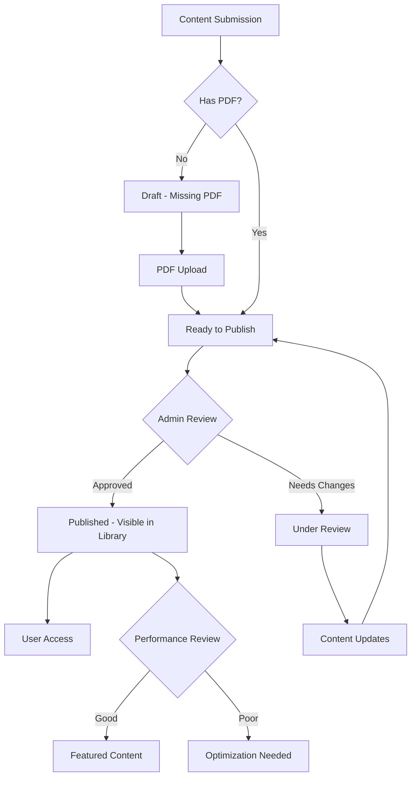

# 1001 Stories - Publication Workflow Guide

## Overview

This guide addresses the critical content management workflow for publishing stories in the 1001 Stories platform. It was created to solve the identified content gap where 22+ stories had PDF files but were not visible in the user-facing library.

## Problem Statement

### The Issue
- **Expected**: 33 books available in the library (based on books-data.ts)
- **Reality**: Only 11 books were visible to users
- **Root Cause**: 22 stories were unpublished (`isPublished: false`) despite having content and PDF files
- **Impact**: Users saw an incomplete library, limiting platform value and user engagement

### Business Impact
- **User Experience**: Library appeared to have limited content (11/33 books)
- **Content Creator Impact**: Authors' work was hidden from readers
- **Platform Perception**: System appeared to have minimal available content
- **SEO Impact**: Reduced content discoverability and search engine indexing

## Solution Architecture

### Immediate Fix: Bulk Publication
1. **Bulk Publication Script** (`bulk-publish-stories.js`)
   - Identifies unpublished stories with PDF files
   - Publishes all ready content in a single transaction
   - Creates comprehensive audit trail
   - Provides detailed success/failure reporting

2. **Admin Interface Enhancement** (`BulkPublishingPanel.tsx`)
   - Visual dashboard for publication status
   - One-click bulk publishing operations
   - Publication statistics and gap analysis
   - Individual story selection and management

3. **API Endpoints**
   - `/api/admin/stories/bulk-publish` - Bulk publish selected stories
   - `/api/admin/stories/bulk-unpublish` - Bulk unpublish selected stories
   - `/api/admin/stories/publish-all` - Publish all ready stories with PDFs

### Long-term Workflow Improvements
1. **Enhanced Content Lifecycle Management**
2. **Automated Quality Gates**
3. **Publication Impact Tracking**

## Content Lifecycle States



## Publication Workflow

### Phase 1: Content Preparation
1. **Story Creation**
   - Title, author, summary, metadata
   - Language and age range classification
   - Category and tag assignment

2. **PDF Generation**
   - Main content PDF (`main.pdf`)
   - Front cover PDF (`front.pdf`) - optional
   - Back cover PDF (`back.pdf`) - optional
   - Cover image (`cover.png`) - for thumbnails

3. **Quality Validation**
   - PDF file integrity check
   - Content metadata completeness
   - Author information verification

### Phase 2: Publication Process
1. **Readiness Check**
   - Story has required metadata
   - PDF file exists and is accessible
   - Cover image available (or placeholder)
   - Author consent confirmed

2. **Publication Execution**
   ```typescript
   {
     isPublished: true,
     publishedDate: new Date(),
     featured: !isPremium, // Free books auto-featured
     updatedAt: new Date()
   }
   ```

3. **Post-Publication Tasks**
   - Update search indexes
   - Generate thumbnails
   - Create shop products (if applicable)
   - Send notifications

### Phase 3: Library Integration
1. **Visibility Rules**
   - Published stories appear in `/library`
   - Unpublished stories only visible in admin
   - Featured stories appear in prominent positions

2. **Access Control**
   - Free stories: Immediate access
   - Premium stories: Purchase required
   - Sample pages available for all books

## Admin Operations Guide

### Bulk Publishing Operations

#### 1. Emergency Bulk Publish (One-Time Fix)
```bash
# Run the bulk publication script
node bulk-publish-stories.js

# Verify results
node verify-publication-results.js

# Check production library
node check-story-status.js
```

#### 2. Using Admin Interface
1. Navigate to `/admin/stories`
2. Review **Bulk Publishing Control** panel
3. Check publication statistics
4. Use "Publish All Ready" for complete operation
5. Or select specific stories for targeted publishing

#### 3. Individual Story Management
1. Access `/admin/stories/[id]/edit`
2. Toggle publication status
3. Update publication date if needed
4. Review and save changes

### Verification Checklist

After bulk publication operations:

- [ ] **Database Verification**
  - All stories with PDFs are published (`isPublished: true`)
  - Publication dates are set correctly
  - Featured status is appropriate (free = featured)

- [ ] **Library Verification**
  - All expected books visible at `/library`
  - Pagination works correctly
  - Filters function properly
  - Search finds all content

- [ ] **User Experience Verification**
  - Book covers load properly
  - PDF files are accessible
  - Reading progress tracking works
  - Bookmarking functionality intact

- [ ] **Performance Verification**
  - Page load times acceptable
  - Search response times reasonable
  - No broken links or missing assets

## Monitoring and Maintenance

### Key Metrics to Track
1. **Content Metrics**
   - Total published books
   - Publication velocity (books/week)
   - Content utilization rate

2. **User Engagement**
   - Library visit frequency
   - Book access patterns
   - Reading completion rates

3. **System Performance**
   - Page load times
   - PDF loading speeds
   - Search response times

### Regular Maintenance Tasks

#### Daily
- [ ] Monitor for new unpublished content
- [ ] Check for broken PDF links
- [ ] Review user access errors

#### Weekly  
- [ ] Publication statistics review
- [ ] Content gap analysis
- [ ] Performance metrics evaluation

#### Monthly
- [ ] Full library audit
- [ ] User feedback review
- [ ] Publication workflow optimization

## Error Handling and Recovery

### Common Issues and Solutions

#### 1. Stories Not Appearing in Library
**Symptoms**: Book count doesn't match database
**Diagnosis**: Check `isPublished` status
**Solution**: Use bulk publishing script or admin interface

#### 2. PDF Files Not Loading
**Symptoms**: "PDF not found" errors
**Diagnosis**: Check file paths in `/public/books/`
**Solution**: Verify PDF file exists, check path formatting

#### 3. Slow Library Loading
**Symptoms**: Long page load times
**Diagnosis**: Check database query performance
**Solution**: Review pagination, optimize queries

#### 4. Missing Cover Images
**Symptoms**: Placeholder images for all books
**Diagnosis**: Check cover image paths
**Solution**: Regenerate covers, verify file locations

### Emergency Recovery Procedures

#### Content Gap Crisis
1. **Immediate**: Run verification script to assess scope
2. **Short-term**: Execute bulk publish for critical content
3. **Medium-term**: Review and fix underlying workflow issues
4. **Long-term**: Implement automated prevention measures

#### Database Inconsistency
1. **Backup**: Create database backup before changes
2. **Analyze**: Use verification scripts to identify issues
3. **Fix**: Apply targeted updates with transaction safety
4. **Verify**: Confirm fixes with comprehensive testing

## Future Enhancements

### Phase 2: Advanced Workflow Features
1. **Automated Publication Scheduling**
   - Schedule books for future publication
   - Batch publishing with time delays
   - Content embargo management

2. **Enhanced Quality Gates**
   - Automated PDF validation
   - Content quality scoring
   - Plagiarism detection integration

3. **Advanced Analytics**
   - Publication performance tracking
   - Content engagement analysis
   - Predictive content recommendations

### Phase 3: Content Intelligence
1. **Smart Publication Recommendations**
   - AI-driven content categorization
   - Optimal publication timing
   - Audience targeting suggestions

2. **Automated Content Processing**
   - PDF generation from text
   - Automatic cover generation
   - Multi-language publication support

## Support and Troubleshooting

### Quick Reference Commands
```bash
# Check current publication status
node check-story-status.js

# Bulk publish all ready stories
node bulk-publish-stories.js

# Verify publication results
node verify-publication-results.js

# Access admin interface
https://1001stories.seedsofempowerment.org/admin/stories
```

### Log Files and Debugging
- **Application Logs**: Check Docker containers for API errors
- **Database Logs**: Monitor Prisma query performance
- **Nginx Logs**: Track static file access patterns
- **Audit Trails**: Review activity logs for publication history

### Contact Points
- **Technical Issues**: System administrator
- **Content Issues**: Editorial team
- **User Reports**: Customer support
- **Performance Issues**: Development team

---

**Last Updated**: August 26, 2025
**Version**: 1.0
**Status**: Active Implementation Guide

This guide addresses the immediate content management crisis while establishing sustainable processes for ongoing publication workflow management.