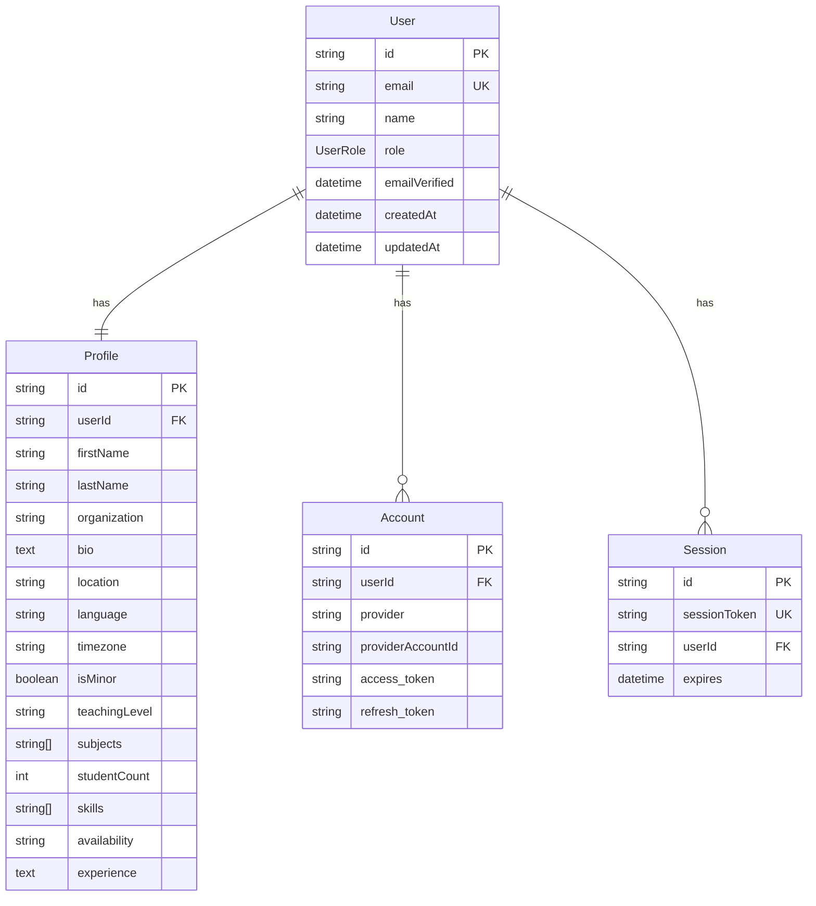
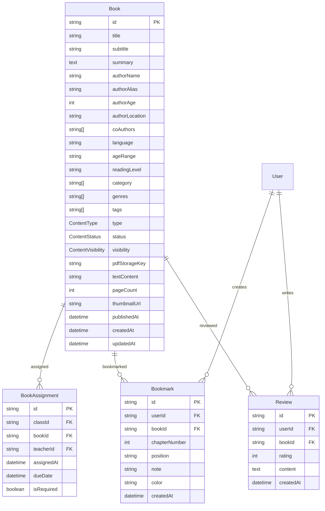
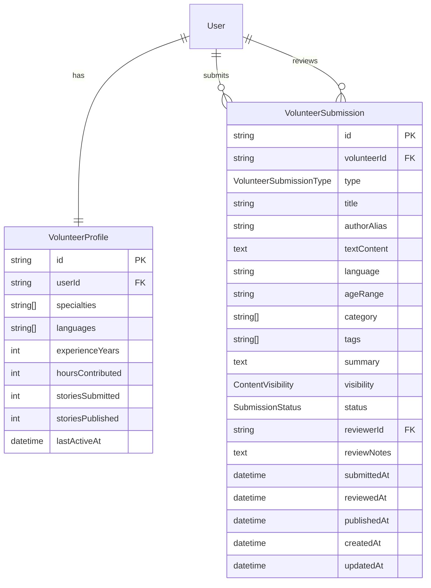

# ERD - 1001 Stories Platform
## Entity Relationship Diagram Specifications

### 1. 데이터베이스 개요 (Database Overview)
- **DBMS**: PostgreSQL 14+
- **ORM**: Prisma ORM v6.13.0
- **Extensions**: pgcrypto (for UUID generation)
- **모델 수**: 130+ (현재) → 65개 (최적화 후)
- **중복률**: 50% → 0% (목표)

### 2. 핵심 도메인 모델 (Core Domain Models)

#### 2.1 사용자 및 인증 (User & Authentication)


#### 2.2 교육 시스템 (Educational System)
```mermaid
erDiagram
    Class {
        string id PK
        string teacherId FK
        string name
        string code UK
        text description
        boolean isActive
        datetime createdAt
    }

    ClassEnrollment {
        string id PK
        string classId FK
        string studentId FK
        datetime enrolledAt
        boolean isActive
    }

    BookAssignment {
        string id PK
        string classId FK
        string bookId FK
        string teacherId FK
        datetime assignedAt
        datetime dueDate
        boolean isRequired
    }

    ReadingProgress {
        string id PK
        string userId FK
        string bookId FK
        int currentPage
        int totalPages
        float progressPercentage
        datetime startedAt
        datetime lastReadAt
        datetime completedAt
    }

    User ||--o{ Class : teaches
    User ||--o{ ClassEnrollment : enrolls
    Class ||--o{ ClassEnrollment : has
    Class ||--o{ BookAssignment : has
    User ||--o{ ReadingProgress : tracks
```

#### 2.3 콘텐츠 관리 (Content Management) - 중복 제거 후


#### 2.4 자원봉사자 시스템 (Volunteer System) - 단순화


### 3. 열거형 정의 (Enum Definitions)

#### 3.1 사용자 역할 (User Roles)
```sql
enum UserRole {
  LEARNER      -- 학습자 (학생)
  TEACHER      -- 교사
  VOLUNTEER    -- 자원봉사자
  INSTITUTION  -- 교육기관 대표
  ADMIN        -- 시스템 관리자
}
```

#### 3.2 콘텐츠 상태 (Content Status)
```sql
enum ContentStatus {
  DRAFT        -- 초안
  SUBMITTED    -- 제출됨
  REVIEWING    -- 검토 중
  APPROVED     -- 승인됨
  PUBLISHED    -- 게시됨
  REJECTED     -- 거부됨
  ARCHIVED     -- 보관됨
}

enum ContentType {
  TEXT_STORY   -- 텍스트 스토리
  PDF_BOOK     -- PDF 도서
  INTERACTIVE  -- 인터랙티브 콘텐츠
}

enum ContentVisibility {
  PUBLIC       -- 공개
  RESTRICTED   -- 제한적
  PRIVATE      -- 비공개
}
```

#### 3.3 제출 및 검토 (Submission & Review)
```sql
enum SubmissionStatus {
  PENDING      -- 대기 중
  REVIEWING    -- 검토 중
  APPROVED     -- 승인됨
  REJECTED     -- 거부됨
  PUBLISHED    -- 게시됨
}

enum VolunteerSubmissionType {
  TEXT_STORY   -- 텍스트 스토리 (기본값)
  TRANSLATION  -- 번역
  ILLUSTRATION -- 삽화
}
```

### 4. 중복 모델 제거 계획 (Duplicate Model Removal Plan)

#### 4.1 Story → Book 통합
```sql
-- REMOVE: Story model (554-620 lines)
-- CONSOLIDATE INTO: Book model (2473-2540 lines)
-- REASON: 중복 콘텐츠 관리, 동일 기능

-- Migration Strategy:
1. Book 모델에 Story 필드 추가
2. Story 데이터를 Book으로 마이그레이션
3. Story 참조를 Book으로 변경
4. Story 모델 삭제
```

#### 4.2 StorySubmission → VolunteerSubmission 통합
```sql
-- REMOVE: StorySubmission model (1349-1400 lines)
-- CONSOLIDATE INTO: VolunteerSubmission model (2544-2600 lines)
-- REASON: 중복 제출 시스템, 워크플로우 동일

-- Migration Strategy:
1. VolunteerSubmission에 StorySubmission 필드 병합
2. StorySubmission 데이터 마이그레이션
3. API 라우터 통합
4. StorySubmission 모델 삭제
```

#### 4.3 Product → ShopProduct 통합
```sql
-- REMOVE: Product model (288-350 lines)
-- CONSOLIDATE INTO: ShopProduct model (500-570 lines)
-- REASON: 중복 상품 관리

-- Migration Strategy:
1. ShopProduct로 통합
2. 전자상거래 관련 필드 정리
3. 미사용 상품 관련 모델 정리
```

#### 4.4 미사용 시스템 제거
```sql
-- REMOVE: Volunteer Quest System (15 models)
Models: Quest, QuestObjective, QuestReward, QuestSubmission,
        QuestReview, QuestComment, QuestAttachment, QuestProgress,
        QuestSkill, VolunteerPoints, VolunteerRedemption, etc.
Lines: ~1,200 lines
Reason: 미구현 기능, 복잡성 증가

-- REMOVE: School Management System (8 models)
Models: School, SchoolDistrict, Department, Grade, Subject,
        Classroom, Schedule, etc.
Lines: ~800 lines
Reason: INSTITUTION 역할로 단순화 가능

-- REMOVE: Advanced E-commerce (12 models)
Models: CartItem, Coupon, Invoice, Shipping, Tax, etc.
Lines: ~900 lines
Reason: 비영리 플랫폼에 불필요
```

### 5. 최적화된 데이터베이스 구조 (Optimized Database Structure)

#### 5.1 핵심 테이블 (65개 → 35개)
```
CORE DOMAIN (15 tables):
- User, Profile, Account, Session
- Book, BookAssignment, ReadingProgress
- Class, ClassEnrollment
- VolunteerSubmission, VolunteerProfile
- Review, Bookmark, ReadingList
- Notification

SUBSCRIPTION & PAYMENT (8 tables):
- Subscription, Entitlement
- Order, OrderItem, Payment
- Donation, RecurringDonation
- Cart

SYSTEM & ADMIN (7 tables):
- MediaFile, ActivityLog
- WorkflowHistory, BulkImport
- UserDeletionRequest
- OnboardingProgress
- Publication

CONTENT MANAGEMENT (5 tables):
- Translation, Illustration
- ContentAccess, ContentPolicy
- SubmissionWorkflow
```

#### 5.2 인덱스 최적화
```sql
-- 성능 중요 인덱스
CREATE INDEX idx_user_email ON users(email);
CREATE INDEX idx_user_role ON users(role);
CREATE INDEX idx_book_status ON books(status);
CREATE INDEX idx_book_language ON books(language);
CREATE INDEX idx_book_category ON books USING GIN(category);
CREATE INDEX idx_submission_status ON volunteer_submissions(status);
CREATE INDEX idx_enrollment_class ON class_enrollments(class_id);
CREATE INDEX idx_enrollment_student ON class_enrollments(student_id);
CREATE INDEX idx_progress_user_book ON reading_progress(user_id, book_id);
```

### 6. 관계 매핑 (Relationship Mapping)

#### 6.1 One-to-One 관계
- User ↔ Profile (필수)
- User ↔ VolunteerProfile (선택적)
- User ↔ Subscription (선택적)

#### 6.2 One-to-Many 관계
- User → ClassEnrollment (학생이 여러 클래스 참여)
- User → Class (교사가 여러 클래스 생성)
- User → VolunteerSubmission (자원봉사자가 여러 제출)
- User → ReadingProgress (사용자가 여러 도서 읽기)
- Class → BookAssignment (클래스에 여러 도서 할당)
- Book → Review (도서에 여러 리뷰)

#### 6.3 Many-to-Many 관계
- User ↔ Book (through ReadingProgress)
- Class ↔ Book (through BookAssignment)
- User ↔ Class (through ClassEnrollment)

### 7. 보안 정책 (Security Policies)

#### 7.1 Row Level Security (RLS)
```sql
-- User data isolation
ALTER TABLE users ENABLE ROW LEVEL SECURITY;
CREATE POLICY user_isolation ON users
  USING (id = current_user_id() OR current_user_role() = 'ADMIN');

-- Class access control
ALTER TABLE classes ENABLE ROW LEVEL SECURITY;
CREATE POLICY class_access ON classes
  USING (teacher_id = current_user_id() OR
         id IN (SELECT class_id FROM class_enrollments
                WHERE student_id = current_user_id()));

-- Volunteer submission access
ALTER TABLE volunteer_submissions ENABLE ROW LEVEL SECURITY;
CREATE POLICY submission_access ON volunteer_submissions
  USING (volunteer_id = current_user_id() OR
         reviewer_id = current_user_id() OR
         current_user_role() = 'ADMIN');
```

#### 7.2 데이터 암호화
```sql
-- Sensitive data encryption
CREATE EXTENSION IF NOT EXISTS pgcrypto;

-- Email encryption for GDPR compliance
ALTER TABLE users
ADD COLUMN encrypted_email bytea
GENERATED ALWAYS AS (pgp_sym_encrypt(email, 'encryption_key')) STORED;
```

### 8. 마이그레이션 전략 (Migration Strategy)

#### 8.1 Phase 1: 데이터 백업
```bash
# 전체 데이터베이스 백업
pg_dump $DATABASE_URL > backup_$(date +%Y%m%d).sql

# 특정 테이블 백업 (중요 데이터)
pg_dump $DATABASE_URL -t users -t books -t volunteer_submissions > critical_backup.sql
```

#### 8.2 Phase 2: 점진적 마이그레이션
```sql
-- Step 1: Story → Book 통합
CREATE TABLE books_new AS SELECT * FROM books;
INSERT INTO books_new (SELECT * FROM stories WHERE ...);
ALTER TABLE books RENAME TO books_old;
ALTER TABLE books_new RENAME TO books;

-- Step 2: 참조 업데이트
UPDATE bookmarks SET book_id = (SELECT new_id FROM migration_mapping WHERE old_story_id = story_id);
UPDATE reading_progress SET book_id = (SELECT new_id FROM migration_mapping WHERE old_story_id = story_id);

-- Step 3: 검증 및 정리
SELECT COUNT(*) FROM books;  -- 예상 개수 확인
DROP TABLE books_old;
DROP TABLE stories;
```

#### 8.3 Phase 3: 성능 검증
```sql
-- 쿼리 성능 테스트
EXPLAIN ANALYZE SELECT * FROM books WHERE status = 'PUBLISHED';
EXPLAIN ANALYZE SELECT * FROM volunteer_submissions WHERE volunteer_id = 'user123';

-- 인덱스 효율성 검증
SELECT schemaname, tablename, indexname, idx_scan, idx_tup_read
FROM pg_stat_user_indexes
ORDER BY idx_scan DESC;
```

### 9. API 데이터 모델 매핑 (API Data Model Mapping)

#### 9.1 Book API Response
```typescript
interface BookResponse {
  id: string;
  title: string;
  authorName: string;
  language: string;
  ageRange?: string;
  category: string[];
  tags: string[];
  status: ContentStatus;
  type: ContentType;
  pageCount?: number;
  thumbnailUrl?: string;
  publishedAt?: string;
  createdAt: string;
}
```

#### 9.2 VolunteerSubmission API Response
```typescript
interface VolunteerSubmissionResponse {
  id: string;
  title: string;
  authorAlias: string;
  type: VolunteerSubmissionType;
  status: SubmissionStatus;
  language: string;
  category: string[];
  tags: string[];
  summary: string;
  textContent?: string;  // 제출자만 접근
  reviewNotes?: string;  // 검토자만 접근
  submittedAt: string;
  createdAt: string;
}
```

### 10. 모니터링 및 메트릭 (Monitoring & Metrics)

#### 10.1 성능 지표
```sql
-- 테이블 크기 모니터링
SELECT
  schemaname,
  tablename,
  pg_size_pretty(pg_total_relation_size(schemaname||'.'||tablename)) as size
FROM pg_tables
WHERE schemaname = 'public'
ORDER BY pg_total_relation_size(schemaname||'.'||tablename) DESC;

-- 활성 연결 수
SELECT count(*) FROM pg_stat_activity WHERE state = 'active';

-- 느린 쿼리 감지
SELECT query, mean_exec_time, calls
FROM pg_stat_statements
ORDER BY mean_exec_time DESC
LIMIT 10;
```

#### 10.2 데이터 품질 검증
```sql
-- 고아 레코드 검사
SELECT COUNT(*) FROM reading_progress rp
WHERE NOT EXISTS (SELECT 1 FROM users u WHERE u.id = rp.user_id);

SELECT COUNT(*) FROM bookmarks b
WHERE NOT EXISTS (SELECT 1 FROM books bk WHERE bk.id = b.book_id);

-- 데이터 일관성 검사
SELECT COUNT(*) FROM class_enrollments ce
WHERE NOT EXISTS (SELECT 1 FROM classes c WHERE c.id = ce.class_id);
```

---

**🎯 최적화 목표**: 130개 모델 → 35개 모델 (73% 감소)
**📊 성능 목표**: 쿼리 응답시간 < 100ms, 동시접속 1000+
**🔒 보안 목표**: RLS 적용, GDPR 준수, COPPA 준수