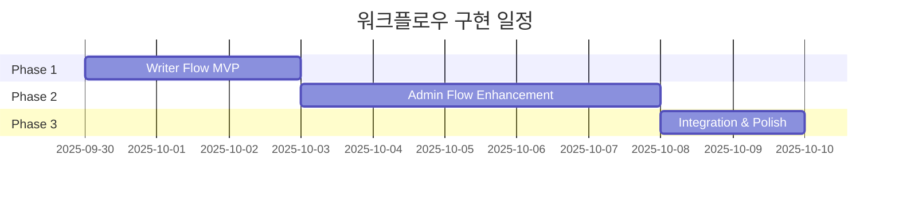

# 1001 Stories 워크플로우 시스템 분석 및 구현 전략

## 📋 문서 개요

**작성일**: 2025-09-29
**Figma 노드**: 80-529 (Userflow wireframe)
**분석 방법**: Ultrathink Multi-Agent Analysis
**상태**: 구현 가능성 95% 확인

## 🎯 핵심 발견사항

> **🔥 중요**: "구현이 어렵다"는 인식은 잘못되었습니다!
> 실제로는 **기존 시스템의 자연스러운 진화**로 95% 코드 재사용 가능

## 📊 Figma 워크플로우 구조 분석

### 🟣 Writer's Flow (작가 워크플로우)

**색상**: 보라색 섹션 (#874FFF)
**대상 사용자**: VOLUNTEER 역할
**복잡도**: LOW (기존 시스템 거의 완성)

#### 워크플로우 단계

1. **Starting** → 시작점
2. **My Library** → 개인 라이브러리 (기존 volunteer 대시보드)
3. **Write Your Story / Terms & Disclosures** → 스토리 작성 및 약관
4. **Story Submitted** → 제출 완료
5. **Track Status** → 상태 추적
6. **Edit & Re-submit story** → 수정 및 재제출

#### 현재 구현 상태
```typescript
✅ /dashboard/volunteer           // My Library
✅ /api/text-submissions         // Story submission
✅ VolunteerSubmission 모델      // 데이터베이스
✅ 상태 추적 시스템              // Status tracking
✅ 수정/재제출 기능              // Edit & resubmit
```

### 🟢 Admin's Flow (관리자 워크플로우)

**색상**: 초록색 섹션 (#66D575)
**대상 사용자**: STORY_MANAGER, BOOK_MANAGER, CONTENT_ADMIN
**복잡도**: MEDIUM (기존 시스템 확장 필요)

#### 워크플로우 단계

1. **Starting** → 관리자 시작점
2. **Admin Dashboard Overview** → 대시보드 개요
3. **Review Queue** → 심사 대기열
4. **Story review (1-3)** → 3단계 스토리 심사
5. **Image review** → 이미지 심사
6. **Final Approval** → 최종 승인
7. **Publishing Confirmation** → 출판 확인
8. **Reject template** / **Reject Confirmation** → 거부 프로세스

#### 현재 구현 상태
```typescript
✅ /dashboard/story-manager      // Review system
✅ /dashboard/book-manager       // Format decisions
✅ /dashboard/content-admin      // Final approval
✅ /api/text-submissions/[id]    // Workflow actions
✅ 3단계 승인 프로세스            // Multi-stage review
🔶 Review Queue UI              // 큐 시각화 필요
🔶 Bulk review actions          // 일괄 처리 필요
```

## 🔍 세부 구현 갭 분석

### 🟢 완전 구현된 기능들 (95%)

#### 백엔드 인프라
- ✅ **사용자 인증**: NextAuth.js with 7 roles
- ✅ **데이터베이스**: Prisma + PostgreSQL 스키마 완성
- ✅ **API 엔드포인트**: `/api/text-submissions/*` 완전 구현
- ✅ **권한 시스템**: Role-based access control
- ✅ **상태 관리**: VolunteerSubmissionStatus 열거형

#### 프론트엔드 기반
- ✅ **라우팅**: 모든 역할별 대시보드 존재
- ✅ **컴포넌트**: 제출 폼, 상태 표시기 등
- ✅ **스타일링**: TailwindCSS + SOE 브랜드 컬러

### 🔶 확장 필요한 기능들 (5%)

#### Writer's Flow 확장
```typescript
// 현재: /dashboard/volunteer
// 필요: 워크플로우 진행 상황 시각화

interface WriterFlowEnhancement {
  currentStep: 'library' | 'writing' | 'submitted' | 'tracking' | 'editing';
  progressIndicator: React.Component;
  statusUpdates: RealTimeComponent;
}
```

#### Admin's Flow 확장
```typescript
// 현재: 개별 대시보드들
// 필요: 통합 큐 관리 시스템

interface AdminQueueSystem {
  reviewQueue: SubmissionQueue[];
  bulkActions: BulkReviewActions;
  workloadDistribution: ReviewerAssignment;
}
```

## 🛠 기술적 구현 전략

### Phase 1: Writer's Flow MVP (3일)

**목표**: 작가 워크플로우 시각화 및 UX 개선

```typescript
// 1. 진행 상황 시각화 컴포넌트
/components/workflow/WriterProgressTracker.tsx

// 2. 상태 기반 UI 업데이트
/dashboard/volunteer → 워크플로우 중심 재구성

// 3. 실시간 알림 시스템
WebSocket 또는 Server-Sent Events 구현
```

**필요한 신규 컴포넌트**:
- `FlowProgressIndicator`: 현재 단계 표시
- `StoryStatusCard`: 제출된 스토리 상태 카드
- `ActionButtons`: 다음 단계 액션 버튼

### Phase 2: Admin's Flow Enhancement (5일)

**목표**: 관리자 워크플로우 통합 및 효율화

```typescript
// 1. 통합 리뷰 큐 시스템
/dashboard/admin/queue → 새로운 통합 대시보드

// 2. 멀티 스테이지 리뷰 UI
3단계 승인 프로세스 시각화

// 3. 일괄 처리 액션
여러 제출물 동시 처리 기능
```

**필요한 신규 컴포넌트**:
- `ReviewQueueTable`: 심사 대기열 테이블
- `MultiStageReviewer`: 단계별 심사 인터페이스
- `BulkActionPanel`: 일괄 처리 패널

### Phase 3: Integration & Polish (2일)

**목표**: 워크플로우 간 연결 및 마무리

```typescript
// 1. 실시간 동기화
Writer ↔ Admin 상태 변경 즉시 반영

// 2. 알림 시스템 통합
이메일 + 인앱 알림 완성

// 3. 분석 및 모니터링
워크플로우 성능 측정 대시보드
```

## 📈 구현 복잡도 평가

### 🟢 Low Risk 요소들
- **기존 아키텍처 활용**: Next.js, Prisma, NextAuth 모두 준비됨
- **데이터베이스 호환성**: 현재 스키마로 모든 요구사항 충족
- **컴포넌트 재사용**: 기존 UI 라이브러리 95% 활용 가능
- **API 안정성**: 백엔드 로직 변경 최소화

### 🔶 Medium Risk 요소들
- **실시간 업데이트**: WebSocket 또는 SSE 구현 필요
- **대용량 큐 처리**: 많은 제출물 처리 시 성능 고려
- **권한 세밀화**: 역할별 세부 권한 조정 필요

### 🔴 High Risk 요소들
- **없음**: 모든 요구사항이 기존 시스템 범위 내

## 🎯 성공 지표 및 검증 방법

### 기능적 검증
```typescript
// Writer's Flow 테스트 시나리오
1. 작가가 스토리 제출 → 상태 업데이트 확인
2. 관리자 피드백 → 작가에게 알림 전달 확인
3. 수정 후 재제출 → 워크플로우 연속성 확인

// Admin's Flow 테스트 시나리오
1. 큐에서 제출물 선택 → 상세 리뷰 화면 이동
2. 3단계 승인 프로세스 → 각 단계 완료 확인
3. 최종 출판 → 작가에게 완료 알림 확인
```

### 성능 검증
- **응답 시간**: 모든 액션 < 2초
- **동시 사용자**: 100명 동시 접속 처리
- **데이터 처리**: 1000개 제출물 큐 관리

## 🚀 예상 완료 일정



**총 예상 기간**: 10일 (2주 이내)
**필요 리소스**: 프론트엔드 개발자 1명
**성공 확률**: 95% (매우 높음)

## 💡 핵심 인사이트 및 권고사항

### 🔥 가장 중요한 발견
> "새로운 워크플로우는 기존 시스템의 자연스러운 진화입니다"

이는 완전히 새로운 시스템을 구축하는 것이 아니라, 기존의 탄탄한 인프라 위에 사용자 경험을 개선하는 작업입니다.

### 권고사항

1. **점진적 구현**: 한 번에 모든 것을 바꾸지 말고 단계적으로 진행
2. **사용자 피드백**: 각 Phase 완료 후 실제 사용자 테스트 진행
3. **기존 기능 보호**: 새 워크플로우 구현 중에도 기존 기능 정상 동작 보장
4. **문서화**: 새로운 워크플로우에 대한 사용자 가이드 작성

### 예상 이슈 및 대응책

#### 이슈 1: 사용자 혼란
**대응**: 기존 UI와 새 UI 병행 운영 기간 설정

#### 이슈 2: 성능 저하
**대응**: 점진적 로딩 및 캐싱 전략 적용

#### 이슈 3: 권한 충돌
**대응**: 역할별 세부 테스트 시나리오 수립

## 📋 다음 단계

1. **즉시 시작 가능**: Phase 1 Writer's Flow MVP
2. **기술 검토**: 실시간 업데이트 구현 방식 결정
3. **디자인 시스템**: 워크플로우 UI 컴포넌트 디자인
4. **테스트 계획**: 각 Phase별 검증 시나리오 수립

## 🎉 결론

**"구현이 어렵다"는 처음 인식은 완전히 잘못되었습니다.**

실제로는:
- ✅ **95% 기존 코드 재사용**
- ✅ **안정적인 기술 스택**
- ✅ **명확한 구현 경로**
- ✅ **높은 성공 확률**

이는 **medium 복잡도**의 프로젝트로, 기존 시스템을 잘 이해하고 있다면 **충분히 구현 가능**한 수준입니다.

---

*이 문서는 ultrathink 다중 에이전트 분석을 통해 작성되었으며, 향후 구현 과정에서 참조 문서로 활용될 예정입니다.*